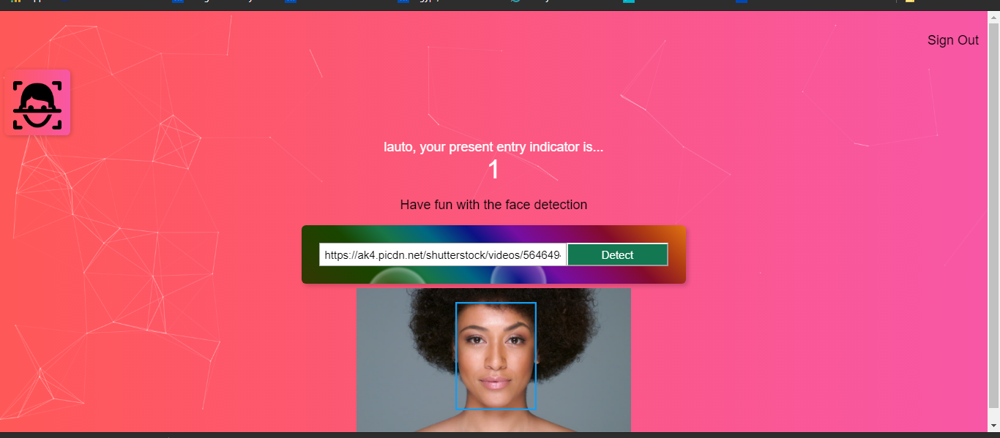

This project was bootstrapped with [Create React App](https://github.com/facebook/create-react-app).

To view a live example, **[click here](https://face-detection-game.herokuapp.com/)**

# App Image!

<h2 align="center">
  
   
</h2>

## Front-End

- HTML5, 
- CSS3, 
- React.js

## NPM Packages

- Create-React-App, 
- Tachyons, 
- react-tilt,
- particles.js, 
- Bcrypt, 
- Postgresql, 
- knex, 
- body parser, 
- cors express.

## APIs

- Clarifai
- Smart Brain API
